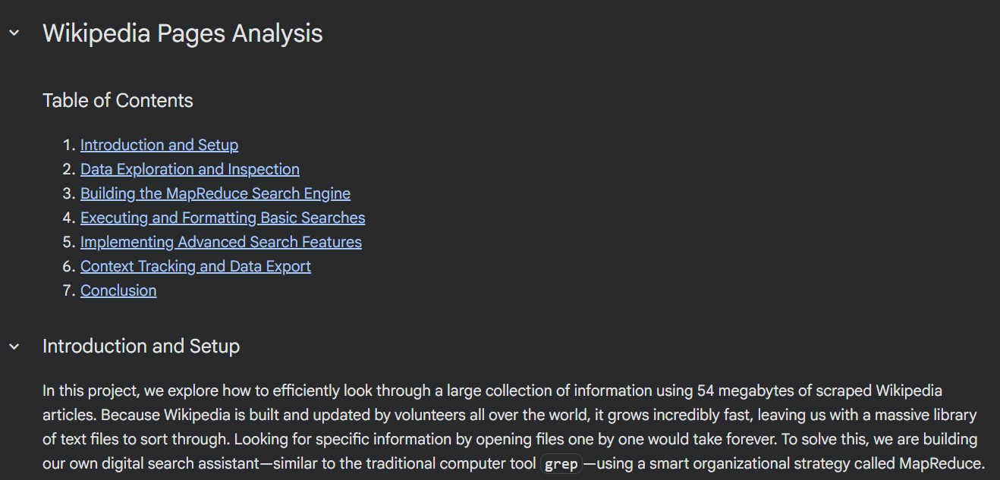

# Wikipedia Pages Analysis
### Parallel Text Search Engine (MapReduce Grep Clone)

This project implements a simplified, high-performance version of the command-line utility `grep` to scan a 54 MB dataset of scraped Wikipedia articles. To avoid the slow speeds of searching files one by one, this tool uses a **MapReduce** ("divide and conquer") architecture. It splits the dataset into chunks, searches them in parallel, and merges the findings into a single dataset.

**Key Features**

* **MapReduce Pipeline:** Divides text files into equal subsets, scans them simultaneously, and aggregates the results.
* **Flexible Search Modes:** Toggles between strict case-sensitive matching and flexible case-insensitive lookups.
* **High-Precision Coordinates:** Logs both the line number and the exact character index where the keyword begins.
* **Context Capture:** Extracts a 60-character text window (30 before and 30 after the keyword) to show how the word is used in context.
* **Automated CSV Export:** Packages all metadata into a structured spreadsheet (`grep_results.csv`) and verifies it using `pandas`.

---

**Project Phases**

1. **Data Inspection:** Assessing the file pool and previewing text formatting.
2. **Engine Architecture:** Building the core chunking, mapping, and reducing functions.
3. **Basic Execution:** Running search tests and formatting results into clean text tables.
4. **Advanced Search:** Integrating case insensitivity and exact location tuple coordinates.
5. **Data Export:** Capturing situational context snippets and exporting the final log to CSV.

---

**Technologies Used**

* **Python 3** (with standard libraries: `os`, `math`, `functools`, `csv`)
* **Pandas** (for final data verification)

---

View this project live on Google Colab [here](https://colab.research.google.com/drive/1IyCIdt4hsVVCEvMkHOPtr1L6CI8ypd7H?usp=sharing)
